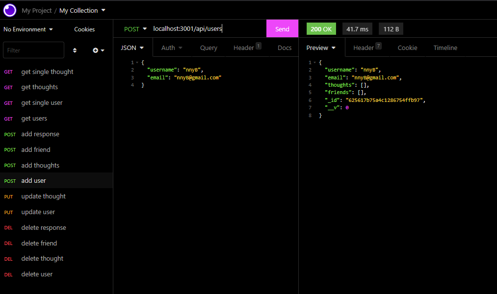
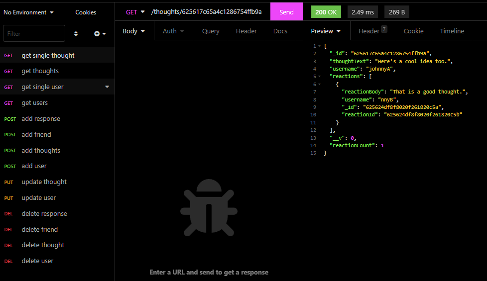
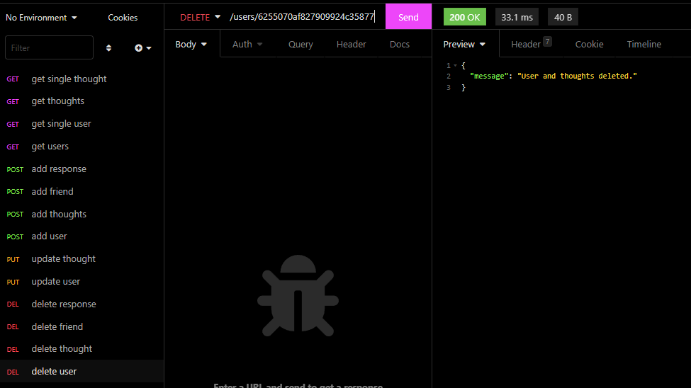

# social-network-api

  ## Description
  I built a sample api for a social network.  You are able to create/update/delete a profile, create/update/delete thoughts(posts), you are able to respond/update/delete your response to other peoples posts, and you are able to add and delete friends.  The project was done for me to gain a better understanding of how Mongoose and noSQL databases work while applying real life scenarios such as a social networking website.
  
  ## Table of Contents
  
  - [Installation](#installation)
  - [Tools](#tools)
  - [License](#license)
  - [Screenshots](#screenshots)
  - [Questions](#questions)
  
  
  ## Installation
  
  Download the repo, npm i.
  
  
  ## Tools
  
  Mongoose, Express
  
  
  ## License

  
  
  ## Screenshots
  

  
  
  ## Questions

  If you have any questions about the project please contact me at.
  - [GitHub](https://github.com/Jsnyder159?tab=repositories)
  - Email: jw.snyder159@gmail.com